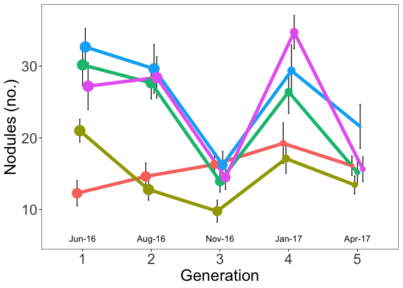
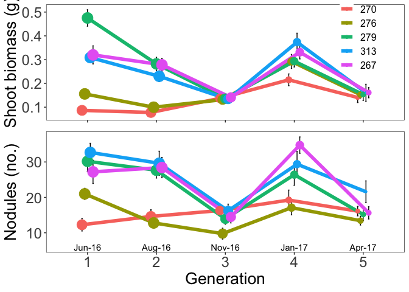

Evolution experiment: analyses
================
Rebecca Batstone
2020-05-27

## Setup

### Global setup, load relevant packages

``` r
# Global setup
knitr::opts_chunk$set(echo = TRUE)

# set contrasts
options(contrasts=c('contr.sum','contr.poly')) ## effects contrasts

# Packages
library(tidyverse) ## includes ggplot2, dplyr, readr, stringr
library("reshape2") ## for melting datasheets
library("cowplot") ## paneled figures, save_plot function
library("car") ## Anova function
library("wesanderson") ## more color palettes
```

## Spreadsheet notes:

  - plants\_I-V is the most up-to-date spreadsheet, for data on all five
    generations
  - “sample” refers to whether I completed a sub-dissection (up to 10
    nodules dissected), or full, meaning every nodule was dissected and
    plated
  - “loc” refers to the spatial distribution of each plant. There were
    22 columns (A-V) and 12 to 13 rows, spanning across three replicate
    benches
  - “type” refers to whether plants were inoculated (exp) or not
    (control) to see how much contamination there was

## Spreadsheet prep:

Load plant-level data, then need nod-level data to summarize key
variables for plants

``` r
# plant level
plants_I_V <- read_csv("./Data/plants_I-V.csv", 
    col_types = cols(
      bench = col_factor(levels = c("one", 
        "two", "three")), 
      gen = col_factor(levels = c("I", 
        "II", "III", "IV", "V")), 
      line = col_factor(levels = c("270", 
        "276", "279", "313", "267")), 
      sample = col_factor(levels = c("sub", 
        "full")), 
      type = col_factor(levels = c("control", 
        "exp"))))

# factor specifications
plants_I_V$plant <- as.factor(plants_I_V$plant)
plants_I_V$line <- factor(plants_I_V$line, levels = c("270","276","279","313","267"))
plants_I_V$gen <- factor(plants_I_V$gen, levels=c("I", "II", "III", "IV", "V"), ordered = TRUE)

# calculate total nodules
plants_I_V$tot_nod <- plants_I_V$nod_diss + plants_I_V$nod_rem

# transform shoot to mg
plants_I_V$shoot.t <- plants_I_V$shoot*1000

# change levels of gen to months
plants_I_V$gen <- recode_factor(plants_I_V$gen,
                         'I'="1", 
                         'II'="2", 
                         'III' = "3", 
                         'IV'="4",
                         'V'="5")
plants_I_V$GS <- plants_I_V$gen
plants_I_V$GS <- recode_factor(plants_I_V$GS,
                         '1'="Jun-16", 
                         '2'="Aug-16", 
                         '3' = "Nov-16", 
                         '4'="Jan-17",
                         '5'="Apr-17")

plants_I_V$GS <- factor(plants_I_V$GS, 
                        levels=c("Jun-16", "Aug-16", "Nov-16", "Jan-17", "Apr-17"), ordered = TRUE)

# str(plants_I_V) ## 1178 obs., 1178 plants

# Exclude controls for rest of analysis
plants_exp <- subset(plants_I_V, type != "control")
plants_exp <- droplevels(plants_exp)
# str(plants_exp)
## 1076 obs.
```

## Figures

### Figure S6

``` r
# summarize the data
sum_plants_exp <- plants_exp %>%
  group_by(gen, GS, line) %>%
  summarize(mean_shoot = mean(shoot, na.rm=TRUE), 
            count_shoot = length(shoot), 
            SE_shoot = sd(shoot, na.rm=TRUE)/sqrt(count_shoot),
            mean_nod = mean(tot_nod, na.rm=TRUE), 
            count_nod = length(tot_nod), 
            SE_nod = sd(tot_nod, na.rm=TRUE)/sqrt(count_nod)) %>%
  as.data.frame(.)
  
(plot_shoot <- ggplot(sum_plants_exp, aes(x=gen, y=mean_shoot, 
                                                colour=line, group=line)) +
  geom_errorbar(aes(ymin=mean_shoot-SE_shoot, ymax=mean_shoot+SE_shoot), colour="black", 
                width=.1, position=position_dodge(0.2)) +
  geom_line(position=position_dodge(0.2), size=2) +
  geom_point(position=position_dodge(0.2), aes(size=count_shoot)) +
  scale_size(guide = FALSE) +
  theme_bw() + 
  xlab("Generation") + 
  ylab("Shoot biomass (g)") +
  scale_colour_discrete(name="Plant line") +
  theme(axis.title.y = element_text(colour = "black", size = 20), 
        axis.text.y = element_text(size=18), 
        axis.title.x = element_blank(), 
        axis.text.x = element_blank(),
        legend.title = element_text(colour="black", size=16, face="bold"),
        legend.text = element_text(colour="black", size=12),
        legend.position = c(0.9,0.8),
        legend.box.background = element_blank(),
        legend.background = element_blank(),
        panel.grid.major = element_blank(), 
        panel.grid.minor = element_blank()))
```

<!-- -->

``` r
(plot_nod <- ggplot(sum_plants_exp, aes(x=gen, y=mean_nod, 
                                                colour=line, group=line)) +
  geom_errorbar(aes(ymin=mean_nod-SE_nod, ymax=mean_nod+SE_nod), colour="black", 
                width=.1, position=position_dodge(0.2)) +
  geom_line(position=position_dodge(0.2), size=2) +
  geom_point(position=position_dodge(0.2), aes(size=count_nod)) +
  scale_size(guide = FALSE) +
  theme_bw() + 
  xlab("Generation") + 
  ylab("Nodules (no.)") +
  scale_colour_discrete(name="Plant line") +
  annotate("text", x = 1:5, y = 6, label = levels(sum_plants_exp$GS)) +
  theme(axis.title.y = element_text(colour = "black", size = 20), 
        axis.text.y = element_text(size=18), 
        axis.title.x = element_text(colour = "black", size = 20), 
        axis.text.x = element_text(size=18), 
        legend.title = element_text(colour="black", size=16, face="bold"),
        legend.text = element_text(colour="black", size=12),
        legend.position = "none",
        panel.grid.major = element_blank(), 
        panel.grid.minor = element_blank()))
```

<!-- -->

``` r
# combine the plots
(fig <- plot_grid(plot_shoot, plot_nod, 
                 ncol=1, nrow=2, 
                 align = "v", 
                 rel_heights=c(1,1.3),
                 labels=NULL))
```

<!-- -->

``` r
save_plot("Figures/FigureS6.pdf", fig, dpi = 1000,
          base_width = 6,
          base_height = 10)
```

### Relative abundance of Em1022 and Em1021 in soil and nodules throughout the evolution experiment

## Proportion of Em1022 in soil (qPCR), Gens II-IV

``` r
# up to and including GS IV
qPCR_all <- read_csv("./Data/qPCR_compiled.csv", 
    col_types = cols(GS = col_factor(levels = c("two", "three", "four")), 
      line = col_factor(levels = c("270","276", "279", "313", "267"))))
# str(qPCR_all) 
## 114 obs

# calculate proportion of Em1022
qPCR_all$prop_Em1022 <- qPCR_all$SQ_Em1022/(qPCR_all$SQ_Em1022 + qPCR_all$SQ_Em1021)

# exclude all 12-Apr-18 entries (not same standard curve)
qPCR_sub1 <- subset(qPCR_all, ! qPCR_date == "12-Apr-18")
qPCR_sub1 <- droplevels(qPCR_sub1)
# str(qPCR_sub1) 
## 101 obs.

# exclude positive controls
qPCR_sub <- subset(qPCR_sub1, ! sample %in% c("pos (10-3)"))
qPCR_sub <- droplevels(qPCR_sub)
qPCR_sub$sample <- as.factor(qPCR_sub$sample)
# str(qPCR_sub)
## 96 obs., 79 plants

# create sample ID
qPCR_sub$sample_ID <- 1:nrow(qPCR_sub) 
qPCR_sub$sample_ID<- as.factor(qPCR_sub$sample_ID)

# summarize for each line within each GS
sum_qPCR_sub <- qPCR_sub %>%
  group_by(GS, line) %>%
  summarize(mean_prop_Em1022 = mean(prop_Em1022, na.rm=TRUE), 
            count = length(prop_Em1022), 
            SE_prop_Em1022 = sd(prop_Em1022, na.rm=TRUE)/sqrt(count)) %>%
  as.data.frame(.)
```

## Proportion of Em1022 in nodules (antibiotic plating), Gen V

``` r
nod_plates <- read_csv("./Data/nod_plates.csv", 
    col_types = cols(strain_call = col_factor(levels = c("1021", 
        "1022"))))
nod_plates$plant <- as.factor(nod_plates$plant)
# str(nod_plates)
## 336 obs, 53 plants

# include plant line
nod_plates$line <- nod_plates$plant
nod_plates$line <- plants_I_V$line[match(nod_plates$line, plants_I_V$loc)]

# need to put data on plant-lvl (each obs per plant)
nod_plates.w <- dcast(nod_plates, plant + line ~ strain_call)

# calculate proportion of Em1022 nods
nod_plates.w$tot_nod <- nod_plates.w$'1021' + nod_plates.w$'1022'
nod_plates.w$prop_Em1022 <- nod_plates.w$'1022' / nod_plates.w$tot_nod

# How many plants per line? get sample size per GS
(count <- with(nod_plates.w, tapply(plant, line, length)))
```

    ## 270 276 279 313 267 
    ##  12   6   9  12  14

``` r
# how many nodules confirmed as Em1021?
nod_Em1021 <- sum(nod_plates.w$'1021') # 11 nods
prop_Em1021 <- nod_Em1021 / nrow(nod_plates) # 0.0327

# add a column for GS (to merge with qPCR data)
nod_plates.w$GS <- "five" 

# subset to plants in which >= 3 nods were scored
nod_plates.ws <- subset(nod_plates.w,
                      nod_plates.w[, c("tot_nod")] >= 3)
nod_plates.ws <- droplevels(nod_plates.ws)
# str(nod_plates.ws)
## 39 plants

# summarize for each line within each GS
sum_nod_plates <- nod_plates.ws %>%
  group_by(GS, line) %>%
  summarize(mean_prop_Em1022 = mean(prop_Em1022, na.rm=TRUE), 
            count = length(prop_Em1022), 
            SE_prop_Em1022 = sd(prop_Em1022, na.rm=TRUE)/sqrt(count)) %>%
  as.data.frame(.)

# merge with qPCR
sum_comb_GS_prop <- rbind(sum_qPCR_sub, sum_nod_plates)

# change back to factor
sum_comb_GS_prop$GS <- factor(sum_comb_GS_prop$GS, levels = c("two","three","four","five"))

# get sample size per GS
(count <- with(sum_comb_GS_prop, tapply(count, GS, sum)))
```

    ##   two three  four  five 
    ##    38    35    23    39

### Figure 1

``` r
palette <- "Royal1"

(plot_sum_comb_GS_prop <- ggplot(sum_comb_GS_prop, aes(x=GS, y=(mean_prop_Em1022*100), 
                                                colour=line, group=line)) +
  geom_rect(aes(xmin = 3.5, xmax = Inf, ymin = -Inf, ymax = Inf),
            fill="#FAEFD1", alpha = 0.5, show.legend = FALSE, color = NA) +
  geom_errorbar(aes(ymin=(mean_prop_Em1022*100)-(SE_prop_Em1022*100),
                    ymax=(mean_prop_Em1022*100)+(SE_prop_Em1022*100)),
                    colour="black",
                    width=.1,
                    position=position_dodge(0.2)) +
  geom_line(position=position_dodge(0.2)) +
  geom_point(size = 4, position=position_dodge(0.2)) +
  theme_bw() + 
  xlab("Plant generation") + 
  ylab("Em1022 (%)") +
  scale_colour_discrete(name="Plant line") +
  scale_x_discrete(breaks=c("two","three","four","five"),
                        labels=c("2","3","4","5")) +  
  #expand_limits(y=25) +
  #geom_hline(aes(yintercept = 33), linetype = 2) +  
  # geom_text(aes(x=2.5, y = 30, 
  #              label="2:1 inoculation ratio Em1021:Em1022"), size=4, color = "black") +
  theme(axis.title.y = element_text(colour = "black", size = 20), 
        axis.text.y = element_text(size=16), 
        axis.title.x = element_text(size=20), 
        axis.text.x = element_text(size=16), 
       legend.title = element_text(colour="black", size=16, face="bold"),
        legend.text = element_text(colour="black", size=12),
        legend.position = c(0.55,0.3),
        legend.background = element_blank(),
        legend.box.background = element_blank(),
        legend.key=element_blank(),
        panel.background = element_rect(fill="transparent"), 
        panel.grid.major = element_blank(), 
        panel.grid.minor = element_blank()))
```

<!-- -->

``` r
save_plot("Figures/Figure1.pdf", plot_sum_comb_GS_prop, dpi = 1000,
          base_aspect_ratio = 1.3)
```

## Models

### How did the ratio of Em1022 to Em1021 change over time through the evolution experiment?

``` r
# first, I need to merge the qPCR and nodule dataset
### change 'sample' to plant in qPCR_sub
colnames(qPCR_sub)[2] <- "plant"

### select overlapping columns
# select variables v1, v2, v3
myvars <- c("line", "plant", "GS", "prop_Em1022")
qPCR_sub2 <- qPCR_sub[myvars]
nod_plates.ws2 <- nod_plates.ws[myvars]

comb_GS_prop <- rbind(qPCR_sub2, nod_plates.ws2)
comb_GS_prop$plant <- as.factor(comb_GS_prop$plant)
comb_GS_prop$GS <- factor(comb_GS_prop$GS, levels = c("two","three","four","five"), ordered = TRUE)
# str(comb_GS_prop)
## 135 obs., 117 plants (some with multiple obs in qPCR)

lm_prop <- lm(prop_Em1022 ~ line*GS, data=comb_GS_prop)
summary(lm_prop)
```

    ## 
    ## Call:
    ## lm(formula = prop_Em1022 ~ line * GS, data = comb_GS_prop)
    ## 
    ## Residuals:
    ##      Min       1Q   Median       3Q      Max 
    ## -0.87837 -0.00014  0.01667  0.04251  0.18215 
    ## 
    ## Coefficients:
    ##              Estimate Std. Error t value Pr(>|t|)    
    ## (Intercept)  0.960562   0.014539  66.068   <2e-16 ***
    ## line1        0.017168   0.028623   0.600   0.5500    
    ## line2       -0.027639   0.030278  -0.913   0.3636    
    ## line3        0.016869   0.031015   0.544   0.5878    
    ## line4        0.004961   0.027902   0.178   0.8593    
    ## GS.L         0.046217   0.025628   1.803   0.0745 .  
    ## GS.Q        -0.048994   0.029078  -1.685   0.0953 .  
    ## GS.C         0.011040   0.032160   0.343   0.7321    
    ## line1:GS.L   0.001454   0.048342   0.030   0.9761    
    ## line2:GS.L   0.076575   0.056634   1.352   0.1795    
    ## line3:GS.L  -0.037562   0.055778  -0.673   0.5023    
    ## line4:GS.L  -0.041860   0.049647  -0.843   0.4012    
    ## line1:GS.Q   0.027808   0.057246   0.486   0.6282    
    ## line2:GS.Q  -0.015663   0.060556  -0.259   0.7965    
    ## line3:GS.Q   0.008383   0.062029   0.135   0.8928    
    ## line4:GS.Q  -0.013855   0.055803  -0.248   0.8045    
    ## line1:GS.C  -0.007085   0.064940  -0.109   0.9133    
    ## line2:GS.C  -0.009395   0.064239  -0.146   0.8840    
    ## line3:GS.C  -0.010903   0.067706  -0.161   0.8724    
    ## line4:GS.C  -0.008899   0.061345  -0.145   0.8850    
    ## ---
    ## Signif. codes:  0 '***' 0.001 '**' 0.01 '*' 0.05 '.' 0.1 ' ' 1
    ## 
    ## Residual standard error: 0.1451 on 96 degrees of freedom
    ##   (19 observations deleted due to missingness)
    ## Multiple R-squared:  0.1186, Adjusted R-squared:  -0.05586 
    ## F-statistic: 0.6798 on 19 and 96 DF,  p-value: 0.8302

``` r
Anova(lm_prop, type=2) ## no sig. interaction, type II used
```

    ## Anova Table (Type II tests)
    ## 
    ## Response: prop_Em1022
    ##            Sum Sq Df F value  Pr(>F)  
    ## line      0.04651  4  0.5519 0.69808  
    ## GS        0.15138  3  2.3951 0.07303 .
    ## line:GS   0.06771 12  0.2678 0.99279  
    ## Residuals 2.02246 96                  
    ## ---
    ## Signif. codes:  0 '***' 0.001 '**' 0.01 '*' 0.05 '.' 0.1 ' ' 1
